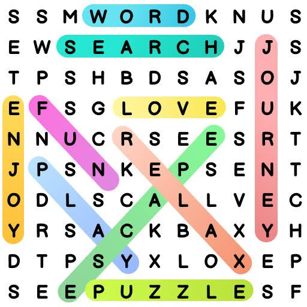

# Problems of Day 1 (08/04/2024)

## Building & Gadgets Puzzle - 1

A firm wants to determine the `highest floor of its n-story` headquarters from which a gadget can fall without breaking.

The firm has two identical gadgets to experiment with. If one of them gets broken, it cannot be repaired, and the experiment will have to be completed with the remaining gadget.

Design an algorithm in the best efficiency class you can to solve this problem.

[Solution of Building & Gadges Puzzle-1](./building_and_gadgets_binary_search.md)

## Word Find Coding Problem - 1

In word find puzzle, the player is asked to find each of a given set of words in a square table filled with single letters.

A word can be read

- horizontally (left or right),
- vertically (up or down), or
- along a 45 degree diagonal (in any of the four directions) formed by consecutively adjacent cells of the table;
- it may wrap around the table’s boundaries.

but it must read in the same direction with no zigzagging.

The same cell of the table may be used in different words, but, in a given word, the same cell may be used no more than once.

Write a program to read the character 2d array (representing square table) and a string, `print true if string is present and false if not.`

[Solution for Word Find Coding Problem - 1](./word_find.c)

## Brute force String matching (Output Based Question - 1)

How many `comparisons` (both successful and unsuccessful) will be made by the brute-force algorithm in searching for each of the following patterns in the `binary text of one thousand zeros`? Explain along answer

a. 00001

b. 10000

c. 01010

[Solution for Brute force string matching output based question - 1](./output_based_brute_force_string_matching.md)

## Finding Equilibrium Index in O(1)

For a given sorted array n {1,2,3,...,n} containing all natural numbers from 1 to n, find an index "i" such that sum of all elements left to array[i] == sum of all elements to the right of art[i].
If there's no such index, print -1.

Note: Time complexity has to be constant: O(1). That is, no loops to be used

For example, n = 119
Equilibrium value: 84
1+2+3+...+84 == 85+86+...+119

[Solution for Equilibrium Index Coding Problem - 2](./equilibrium_index_inclusive_in_lhs.c)

### Variations to Finding Equilibrium Index in O(1)

[Solution to when equilibrium value is not added to either of LHS and RHS](./equilibrium_index.c)

[Solution to when the equilibrium value is added to LHS](./equilibrium_index_inclusive_in_lhs.c)

[Solution to print the first 10 equilibrium N values and their corresponding equilibrium values](https://github.com/hi-Kartik2004/quantmasters-dsa/blob/master/day_1_08_04_2024/first_ten_equilibrium_numbers.c)
