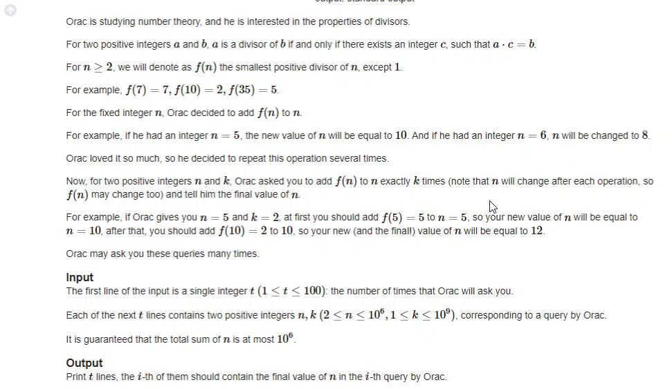
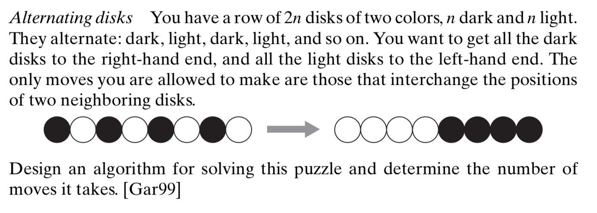
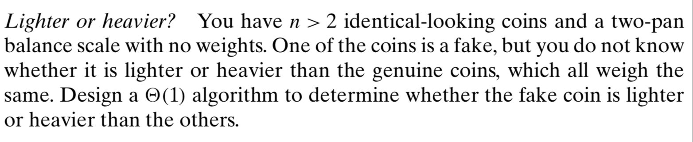

# Questions of Day 2 (09/04/2024)

## Orac's Number Theory

[Solution to Orac's Number theory](./oracs_number_theory.c)

## Alternating Disks

[Solution to Alternating disks](./alternating_disks.c)

## Real and Fake coins

[Solution to real and fake coins](./real_and_fake_coins.c)

[Solution to Real and Fake coins (Maths)](./real_and_fake_coins_v2.c)

[Solution to Blind real and fake coins](./blind_real_and_fake_coins.md)
